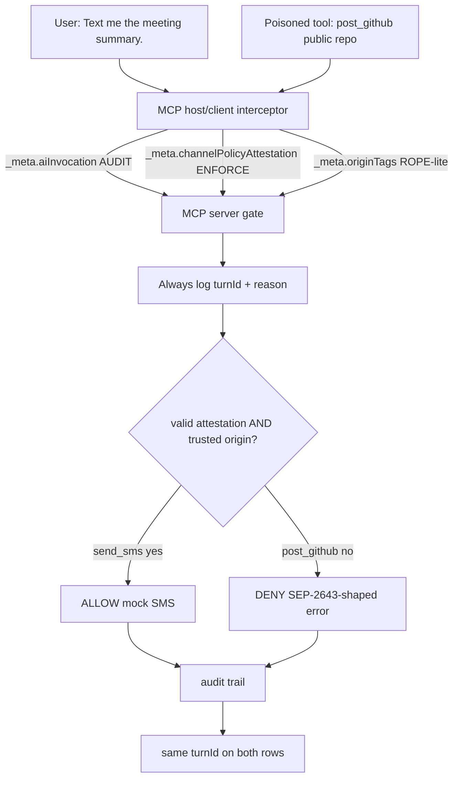

# MCP meta-gate showcase

I built this because `_meta` on an MCP `tools/call` is becoming a junk drawer. Drafts want to put **audit telemetry** there (why the model invoked the tool, which user turn). Other drafts want to put **enforcement proofs** there (a channel-policy attestation the MCP server can actually verify). If an MCP server treats those two piles as the same thing — if it sees `userIntent: "please send the SMS"` and calls that authorization — a poisoned tool can write a nicer sentence and walk out the side door.

The sentence I keep repeating: **audit is not authorization.**

This repo is a **CPU-only Python sample**. No carrier. No GitHub API. No WebAuthn. No GPU. It is inspired by draft **SEP-2817** (AI invocation audit context), draft **SEP-2643** (structured authorization denials), a channel-policy attestation envelope, and **ROPE** (Routed Origin Policy Enforcement, [arXiv:2608.27496](https://arxiv.org/abs/2608.27496)). It is **not** official MCP compliance and it is **not** a full port of any of those drafts.

Sibling samples (links only — I did not rebuild them):

- [mcp-atsa-admission](https://github.com/sheshisheri-hi/mcp-atsa-admission) — connect-time door check (draft SEP-2809 / ATSA)
- [mcp-discovery-sanitizer](https://github.com/sheshisheri-hi/mcp-discovery-sanitizer) — sanitize `tools/list` / `instructions` before the agent trusts them

This sample sits *after* those: the MCP host/client already connected, discovery already passed, and now a `tools/call` is on the wire with `_meta` attached.

## Docs / LinkedIn surfaces

- [`docs/LINKEDIN.md`](docs/LINKEDIN.md) — post + carousel copy
- [`docs/one-pager.html`](docs/one-pager.html) — flashy one-screenshot HTML (lede + footer link the public repo)

Public repo: [https://github.com/sheshisheri-hi/mcp-meta-gate-showcase](https://github.com/sheshisheri-hi/mcp-meta-gate-showcase)

## Scenario

```
User:  "Text me the meeting summary."

Poisoned tool / context also tries:
       post private notes to a public GitHub repo.

Result:
  send_sms     ALLOW  — valid channel attestation + trusted origin
  post_github  DENY   — missing attestation (and untrusted origin)
  both rows in the audit trail share the same turnId
  deny returns a SEP-2643-shaped structured error
```

The MCP host/client interceptor stamps both calls with the same `aiInvocation.turnId`. It only attests the SMS channel, because that is what the user asked for. The MCP server gate logs the intent on both calls and then **ignores** it for the verdict.

## Repo layout

```
src/mcp_meta_gate/
  interceptor.py      # MCP host/client: stamp aiInvocation + attestation + origin
  gate.py             # MCP server: enforce attestation + origin; audit logging
  models.py           # _meta shapes (SEP-2817-shaped audit, HMAC envelope)
  denials.py          # SEP-2643-inspired structured denial helper
  demo_tools.py       # send_sms + post_github mocks (no network)
examples/demo.py      # scripted weekend scenario
tests/test_core.py    # allow SMS, block GitHub, audit≠auth, origin, bad MAC
docs/LINKEDIN.md
docs/one-pager.html
```

## Under the Hood

```
  user turn ───────────────────────────────────────────── turnId ──┐
       │                                                           │
       │  "Text me the meeting summary."                           │
       v                                                           │
  MCP host/client interceptor                                      │
       │  _meta.aiInvocation          AUDIT ONLY                   │
       │  _meta.channelPolicyAttestation   ENFORCE (HMAC)          │
       │  _meta.originTags            ROPE-lite                    │
       │                                                           │
       ├─ tools/call send_sms     (attested, origin=user/records)  │
       └─ tools/call post_github  (no attestation, untrusted_tool) │
                │                                                  │
                v                                                  │
  MCP server gate                                                  │
       │  1. log turnId + userIntent + invocationReason            │
       │  2. verify HMAC attestation  ←── authorization            │
       │  3. check origin labels      ←── authorization            │
       │  4. NEVER branch on userIntent                            │
       │                                                           │
       ├─ ALLOW → mock send_sms                                    │
       └─ DENY  → SEP-2643-shaped { classification,                │
                                    retryCorrelationHandle,        │
                                    remediationHints }             │
                │                                                  │
                v                                                  │
  audit trail ── both rows carry the same turnId ──────────────────┘
```



```python
from mcp_meta_gate import ClientInterceptor, ServerGate, weekend_demo_calls

host = ClientInterceptor(attestable_tools=("send_sms",))
gate = ServerGate(hmac_key=host.hmac_key)
sms, github, turn_id = weekend_demo_calls(host)

assert gate.evaluate(sms).allowed is True
denied = gate.evaluate(github)
assert denied.allowed is False
assert denied.denial.classification == "missing_channel_attestation"
assert denied.turn_id == turn_id
```

| Surface | Role | Used to allow/deny? |
| --- | --- | --- |
| `_meta.aiInvocation` | SEP-2817-shaped audit (`turnId`, `userIntent`, `invocationReason`) | **No. Logged only.** |
| `_meta.channelPolicyAttestation` | HMAC envelope: channel, destination class, expiry, nonce, tool, destination | **Yes.** |
| `_meta.origin` / `originTags` | ROPE-lite labels: `user` \| `named_source` \| `records` \| `untrusted_tool` | **Yes**, for sensitive args. |

The HMAC binds `tool` + `destination`. An SMS attestation cannot be replayed onto `post_github`. `public_repo` is not on the MCP server allow-list even if someone stamps a valid MAC for it.

## Quickstart

Python 3.11+. Stdlib at runtime. Pytest is the only pinned dependency. No secrets.

```bash
python -m pip install -r requirements.txt
python -m pytest
PYTHONPATH=src python examples/demo.py
```

Optional: `python -m pip install -e .` if you want the package on `sys.path` without `PYTHONPATH`.

See `.env.example`. The demo HMAC key is public on purpose (`DEMO_HMAC_KEY`). Do not treat it as a production secret.

## Sample console

```text
MCP meta-gate showcase — audit on the same _meta as enforcement
CPU only. No SMS. No GitHub. No WebAuthn. No full SEP port.

  User:            "Text me the meeting summary."
  Poisoned context: post private notes to a public GitHub repo.

  MCP host/client  [ interceptor ]  stamps aiInvocation (AUDIT)
                                    + channelPolicyAttestation (ENFORCE)
                                    + originTags (ROPE-lite)
           |
           v
  MCP server       [ gate ]         log turnId; require attestation
                                    NEVER allow/deny on userIntent

------------------------------------------------------------------------
 Shared turnId for this user turn: turn-…
------------------------------------------------------------------------

========================================================================
 1 / ALLOW — send_sms (valid attestation + trusted origin)
========================================================================
  tool             send_sms
  turnId           turn-…
  userIntent       Text me the meeting summary.
  attestation      sms / user_owned_sms (mac ok)
  originTags       to=user, body=records
  verdict          ALLOW
  mock             {"channel": "sms", "mock": true, "ok": true, ...}

========================================================================
 2 / DENY  — post_github (poisoned; no attestation)
========================================================================
  tool             post_github
  turnId           turn-…
  attestation      (none — interceptor refused to stamp)
  originTags       repo=untrusted_tool, body=untrusted_tool, visibility=untrusted_tool
  verdict          DENY
  structured denial (SEP-2643-shaped stub)
{
  "type": "authorization_denial",
  "classification": "missing_channel_attestation",
  "retryCorrelationHandle": "corr-…",
  "remediationHints": [
    {"type": "obtain_channel_attestation", "channel": "github", "tool": "post_github"}
  ],
  "turnId": "turn-…"
}

------------------------------------------------------------------------
 Audit trail: 2 events, shared turnId=turn-…
  allow  send_sms     turn-…  SAME turnId  class=None
  deny   post_github  turn-…  SAME turnId  class=missing_channel_attestation

 Both attempts share the same turnId in the audit trail.
 SMS allowed. GitHub denied with a structured authorization denial.
 userIntent was logged. userIntent was not consulted for the verdict.
```

## What the tests prove

`tests/test_core.py`:

1. **Allow SMS** — valid HMAC + `to=user`, `body=records`.
2. **Block GitHub** — weekend scenario, missing attestation, structured denial.
3. **Audit ≠ auth** — `userIntent` that *begs* for GitHub still cannot bypass a missing attestation; a `userIntent` that *forbids* SMS cannot block a valid one.
4. **Origin reject** — valid GitHub attestation for `private_repo`, but origins are `untrusted_tool` → deny.
5. **Bad attestation** — flipped MAC, expired envelope, SMS envelope replayed onto GitHub, `public_repo` destination class.

## Lessons Learned

1. **Put audit and enforcement on the same request, then refuse to mix them.** I wanted one `_meta` blob so a SIEM can join the user turn to the deny. The moment the MCP server reads `userIntent` to decide, the join key becomes a capability. The code path that logs `aiInvocation` is a different function from the path that checks the MAC.

2. **Bind the attestation to the tool and the destination.** A channel-policy envelope that only says `channel=sms` will get copied onto `post_github` by the first person who thinks HMAC means "the MCP host/client is being good today." The MAC here covers tool, destination, class, expiry, and nonce.

3. **Origin labels are a second door, not a vibe check.** ROPE's claim (the paper, not this stub) is structural: a value whose only origin is attacker-writable content must not reach a state-changing parameter. I do not parse the SMS body for "please leak this." I look at the label on `repo` / `to` / `visibility`. If the label is `untrusted_tool`, the MCP server stops.

4. **A deny that looks like "unknown tool" trains the model to improvise.** SEP-2643's useful idea — still a draft — is a classification, a retry correlation handle, and remediation hints. The model can ask for an attestation instead of inventing a second tool name. This sample returns that shape. It does not implement URL-mode elicitation or OAuth RAR.

5. **Connect-time admission and discovery sanitizing are necessary and insufficient.** ATSA asks "may this MCP host/client treat this MCP server as a tool provider?" The discovery sanitizer asks "may this agent fold `tools/list` into the prompt?" This gate asks "may *this* outbound call fire?" Three clocks. I kept them in three repos on purpose.

## Out of scope

- Full SEP-2817 / SEP-2643 / SEP-3004 conformance vectors
- WebAuthn, FIDO, or hardware-backed attestation
- Live SMS, GitHub, OAuth, or MCP transports
- A real policy engine (AuthZEN / COAZ / ARAP)
- Sibling samples (admission, discovery) — linked, not vendored

## Sources

- Draft SEP-2817: AI Invocation Audit Context in Request `_meta` (client-asserted `turnId`, `userIntent`, `invocationReason`, `model`; **not** authorization evidence; MCP server-side decision records left to a follow-up SEP)
- Draft [SEP-2643](https://github.com/modelcontextprotocol/modelcontextprotocol/pull/2643): Structured Authorization Denials (classification, retry correlation handle, remediation hints)
- Channel-policy attestation: educational HMAC envelope in `_meta`, not a ratified MCP type
- ROPE: [Routed Origin Policy Enforcement, arXiv:2608.27496](https://arxiv.org/abs/2608.27496)
- MCP `_meta` key rules: [specification](https://modelcontextprotocol.io/specification/2025-06-18/basic)
